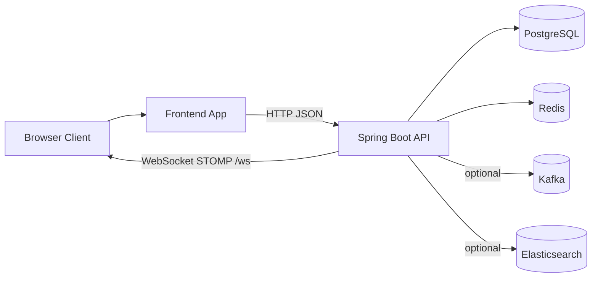
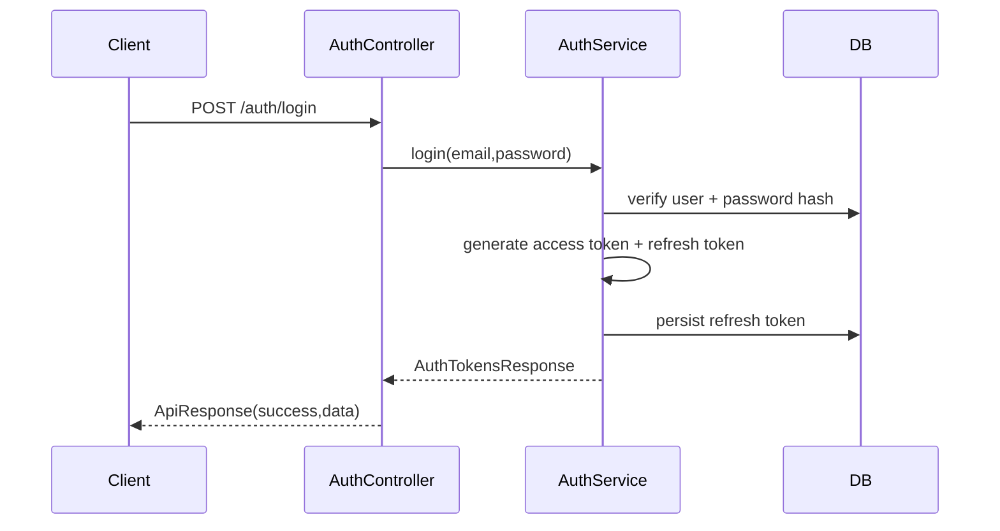
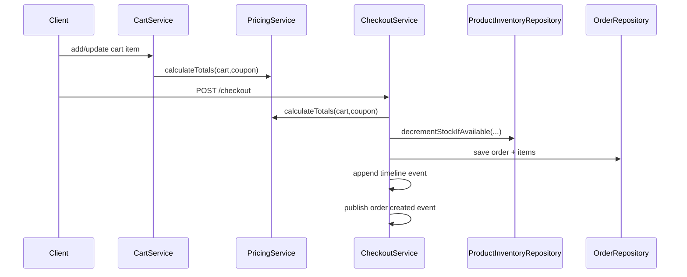

# Architecture

## 1. System Context

NOURA is a split frontend/backend system:
- Backend (`backend/`): Spring Boot API and business logic
- Frontend (`frontend/`): React dashboard and enterprise storefront code paths
- Data/infra: PostgreSQL, Redis, optional Kafka and Elasticsearch

At runtime, clients call REST endpoints under `/api/v1`, authenticated by JWT for protected operations.

## 2. High-Level Component Diagram



## 3. Backend Architecture

### 3.1 Layered Design

```text
Controller -> Service -> Repository -> Database
              |            |
              |            -> Redis (cache/session/pubsub)
              -> Eventing (Spring events / Kafka)
```

- `controller/`: REST transport and HTTP contracts
- `service/impl/`: business rules, ownership checks, state transitions
- `repository/`: persistence and query APIs
- `config/`: security, startup validation, CORS, cache, websocket, rate limiting
- `common/`: API response format and error handling

### 3.2 Security Pipeline

Request path through filters:

1. `RateLimitFilter`
2. `RequestCorrelationFilter`
3. `JwtAuthenticationFilter`
4. Spring Security authorization checks

Key behavior:
- Public routes:
  - `POST /api/v1/auth/**`
  - `GET /api/v1/products/**`
  - `GET /api/v1/stores/**`
  - `GET /api/v1/search/**`
  - `GET /api/v1/recommendations/**`
  - Swagger/health endpoints
- All others require authentication.
- Additional service-level role checks via `@PreAuthorize`.

### 3.3 Data Model Highlights

- Users + roles (`users`, `user_roles`)
- Product catalog (`products`, `categories`, `brands`, `product_variants`, `product_media`, `product_inventory`)
- Commerce flows (`carts`, `cart_items`, `orders`, `order_items`)
- B2B approval (`b2b_company_profiles`, `approval_requests`)
- Notifications (`notifications`)
- Security/session (`refresh_tokens`, `password_reset_tokens`)
- Timeline/audit support (`order_timeline_events`, `created_at/updated_at/created_by` on auditable entities)

### 3.4 Caching and State

- Redis cache manager is configured with TTLs:
  - `products`: 10 min
  - `stores`: 5 min
  - `recommendations`: 3 min
- Spring Session uses Redis store type.
- Notification fan-out uses Redis pub/sub channel (`notifications.channel` by default).

### 3.5 Eventing and Realtime

- On checkout success:
  - `OrderCreatedEvent` is published
  - local event listener sends notification
  - optional Kafka publish (`app.kafka.enabled=true`)
- WebSocket/STOMP endpoint: `/ws` (SockJS enabled)
- Broker prefixes:
  - topics: `/topic`
  - queues: `/queue`
  - app prefix: `/app`
  - user prefix: `/user`

## 4. Core Runtime Flows

### 4.1 Authentication Flow



### 4.2 Cart + Checkout Flow



Important implementation details:
- Checkout supports optional idempotency key (`orders.user_id + idempotency_key` unique index).
- Stock decrement uses atomic DB update query to reduce race conditions.
- Coupon validation includes active window (`valid_from`, `valid_until`) and single-code enforcement.

### 4.3 Notification Flow

1. Notification created in DB (`NotificationServiceImpl`).
2. Notification DTO is published to Redis channel.
3. `RedisNotificationSubscriber` consumes message and broadcasts via STOMP topic:
   - global: `/topic/notifications`
   - targeted: `/topic/notifications/{targetUserId}`
4. Service also sends direct user destination message: `/user/{email}/queue/notifications`.

## 5. Frontend Architecture

### 5.1 Current Build Target

`src/main.tsx` imports `@/app/App`, and Vite alias maps `@` to `src/admin`.

Result:
- Current default runtime app: `src/admin/*`
- Enterprise path (`src/enterprise/*`) exists but is not current default build target.

### 5.2 Frontend Layers (Admin path)

- `app/`: router, store, providers
- `api/`: Axios client and backend integration modules
- `features/`: Redux slices (auth, notifications, theme)
- `layouts/`: shell/navigation/layout
- `pages/`: route views
- `routes/`: `ProtectedRoute`, role gate route

### 5.3 Frontend Auth Handling

- Login endpoint: `POST /api/v1/auth/login`
- Persisted auth object in local storage
- Axios request interceptor adds bearer token
- Route protection:
  - `ProtectedRoute`: requires token
  - `RoleRoute`: checks allowed roles

## 6. Deployment View

### Docker Compose Services

- `postgres` (required)
- `redis` (required)
- `backend` (required)
- `frontend` (required)
- `zookeeper`, `kafka` (optional `eventing` profile)
- `elasticsearch` (optional `search` profile)

### Runtime Ports

- Backend: `8080`
- Frontend container: `8081` (serving Nginx static build)
- PostgreSQL: `5432`
- Redis: `6379`
- Kafka: `9092` (profile)
- Elasticsearch: `9200` (profile)

## 7. Architectural Risks / Observations

- Frontend app paths are split (`admin`, `enterprise`, legacy storefront), increasing maintenance overhead.
- Backend Dockerfile currently copies a `1.0.0` jar filename while project version is `1.1.0`.
- Rate limiting is in-memory and not distributed across instances.
- Elasticsearch gateway exists but currently still uses repository fallback behavior.

## 8. Target Commerce Blueprint (Proposed)

This section captures a proposed target architecture for catalog, PIM, inventory, pricing, and channel integration.  
It is a forward-looking design, not a statement of what is fully implemented today.

### 8.1 Product Catalog Management

Domain entities:
- `Category` (self-referential parent/child hierarchy)
- `Attribute` (name, data type, allowed values)
- `AttributeSet` (reusable attribute groups)
- `Product` (shared product data: name, description, SEO metadata, status)
- `ProductVariant` (SKU, variant attribute values, price override, stock linkage)
- `ProductMedia` (image/video URLs, CDN references, primary flag)

JPA guidance:
- `@ManyToOne` for product -> category and parent/child category relation
- `@OneToMany` for product -> variants and product -> media
- `@ManyToMany` for attribute sets and attributes (join table)
- `@ElementCollection` or custom type mapping for JSONB attribute payloads in PostgreSQL

Recommended catalog endpoints:
- `POST /api/v1/categories`
- `GET /api/v1/categories/tree`
- `POST /api/v1/attributes`
- `POST /api/v1/attribute-sets`
- `POST /api/v1/products`
- `GET /api/v1/products`
- `PUT /api/v1/products/{id}`
- `PATCH /api/v1/products/{id}`
- `DELETE /api/v1/products/{id}` (soft delete, e.g. `is_active=false`)

Example product create payload:

```json
{
  "name": "T-Shirt",
  "description": "Cotton T-Shirt",
  "categoryId": "e29d5d67-dbd5-4afb-bf42-a81951de5de7",
  "attributes": {
    "brand": "Nike",
    "material": "Cotton"
  },
  "variants": [
    {
      "sku": "TS-RED-S",
      "attributes": { "color": "Red", "size": "S" },
      "price": 19.99,
      "stock": 100
    }
  ],
  "media": [
    { "type": "image", "url": "https://cdn.example.com/tshirt.jpg", "isPrimary": true }
  ],
  "seo": {
    "slug": "nike-t-shirt",
    "metaTitle": "Nike Cotton T-Shirt",
    "metaDescription": "Comfortable cotton T-shirt"
  }
}
```

Database recommendations:
- Use JSONB for flexible product/variant attributes:
  - `products.attributes JSONB`
  - `product_variants.attributes JSONB`
- Use GIN indexes for JSONB filtering:
  - `CREATE INDEX idx_products_attr_gin ON products USING gin (attributes);`
- Add btree indexes for high-selectivity lookup fields:
  - `sku`
  - `category_id`
  - `created_at`

#### Enterprise Category Management Model

Hierarchical taxonomy example:

```text
Electronics
   ├── Computers
   │     ├── Laptops
   │     └── Desktops
   ├── Mobile Phones
   │     ├── Smartphones
   │     └── Accessories
```

Design goals:
- customer-friendly navigation and discovery
- consistent enterprise classification across systems
- deep trees (commonly 5-10 levels) without taxonomy drift

Category governance model:
- assign category ownership (category manager per branch)
- enforce taxonomy approval workflow for create/update/delete
- apply naming conventions and classification standards
- keep audit history for structural/category metadata changes

Attribute-based categorization:
- use typed attributes (brand, screen size, RAM, color, etc.) for filtering, faceting, and product comparison
- model reusable attribute sets to keep classification consistent across related categories

AI-assisted categorization (target state):
- NLP title/description classification for initial category suggestion
- duplicate-category and synonym detection
- data normalization suggestions (attribute value cleanup)
- optional image-based inference for visual product families

Multi-channel taxonomy mapping:
- maintain channel-specific taxonomy mappings for Amazon/Walmart/Alibaba/internal storefronts
- keep canonical internal taxonomy and map outward per channel

Category performance analytics:
- track revenue, conversion rate, inventory turnover, margin, and discoverability by category node
- feed metrics back into taxonomy optimization and merchandising decisions

Localization and regional taxonomy:
- support locale-specific names and synonyms (for example `Pants` vs `Trousers`)
- localize taxonomy for SEO and regional user expectations

Enterprise system integration:
- ERP: source-of-truth product and supply context
- PIM: taxonomy + attribute stewardship
- CMS: merchandising and content binding
- Search/Recommendation: ranking and filter behavior
- Analytics: category performance loops

Implementation status in this repository:

| Capability | Current status | Notes |
|---|---|---|
| Hierarchical categories | Implemented | `categories.parent_id` + `GET /api/v1/categories/tree` |
| Attribute + attribute sets | Implemented | JSONB attributes + reusable sets |
| Governance workflow | Planned | add approver roles, workflow states, and audit policy |
| AI auto-categorization | Planned | add suggestion service + human-in-the-loop approval |
| Multi-channel mappings | Planned | add `channel_product_mapping` and channel adapters |
| Category analytics KPI model | Planned | add reporting tables/materialized views |
| Localization/regional taxonomy | Planned | add translation tables for category metadata |
| Cross-system integration contracts | Partial | eventing/search foundations exist; taxonomy-specific contracts pending |

Bulk import/export:
- Use Spring Batch for large CSV/XML ingestion and export
- Upload triggers async batch job and returns a job ID
- Exports run in background and notify via email/WebSocket

### 8.2 Product Information Management (PIM)

Data enrichment workflow:
- Model lifecycle with Spring State Machine:
  - `DRAFT -> PENDING -> APPROVED -> PUBLISHED`
  - rejection path: `REJECTED`
- Emit approval events to in-app/email notifications

Localization and currency:
- Translation table pattern:
  - `product_translation(product_id, locale, name, description, slug)`
- Monetary handling:
  - store canonical/base price (for example USD)
  - support derived exchange-rate pricing or persisted per-currency prices
  - prefer Java Money (JSR 354) semantics in pricing service

Versioning/audit:
- Use Hibernate Envers for entity audit trails
- Or maintain explicit `product_version` snapshots for replay/rollback

Channel syndication:
- `channel_product_mapping` for channel-specific IDs and field mapping
- Use outbox pattern + Kafka for reliable external push
- Channel sync workers call marketplace APIs (Amazon/eBay/etc.)

### 8.3 Inventory Management

Core entities:
- `warehouse(id, name, location, is_active)`
- `inventory(id, variant_id, warehouse_id, quantity, reserved_quantity, reorder_point, ...)`
- `inventory_transaction(id, variant_id, warehouse_id, change_quantity, type, order_id, note, ...)`

Consistency and concurrency:
- Reserve at order placement:
  - decrement available, increment reserved
- Confirm at shipment:
  - decrement reserved
- Release on cancellation/payment failure:
  - decrement reserved, increase available
- Use optimistic locking (`@Version`) on inventory rows
- For flash-sale load, optionally use Redis counters with async DB reconciliation

Recommended inventory endpoints:
- `GET /api/v1/inventory/{variantId}`
- `POST /api/v1/inventory/adjust`
- `POST /api/v1/inventory/reserve`
- `POST /api/v1/inventory/release`
- `POST /api/v1/inventory/confirm`
- `POST /api/v1/inventory/check`

Low stock alerts:
- Scheduled or event-driven checks for `quantity <= reorder_point`
- Notify buyers/suppliers via email or notification center

### 8.4 Pricing and Promotions

Core entities:
- `price(id, variant_id, price_list_id, amount, currency, start_date, end_date, priority)`
- `price_list(id, name, type, customer_group_id, channel_id)`
- `promotion(id, name, type, coupon_code, conditions_json, start_date, end_date, is_active)`
- `promotion_application(promotion_id, applicable_entity_type, applicable_entity_id)`

Pricing resolution order:
1. Base price list (`BASE`)
2. Customer/group/channel override list
3. Active promotion application by priority
4. Return computed final price

Promotion engine options:
- Strategy-pattern evaluators (simple and maintainable)
- Drools for complex rule authoring
- SpEL-backed condition checks for moderate complexity

Caching:
- Cache computed prices in Redis with TTL bounded by nearest change window

Scheduled pricing:
- Activate/deactivate by `start_date` and `end_date` in query filters or scheduled toggles

### 8.5 Supplier and Vendor Management

Entities:
- `supplier(id, name, contact_info, payment_terms)`
- `supplier_product(supplier_id, variant_id, supplier_sku, cost_price, lead_time_days, minimum_order_quantity)`

Integration:
- Supplier catalog ingestion via CSV/XML/API
- Spring Integration pipelines for mapping supplier SKUs to internal SKUs
- Purchase order generation references supplier lead time and cost

### 8.6 Order Integration and Reservation Saga

Cross-service sequence (target):
1. Order service requests inventory check
2. Inventory reserves stock and returns reservation ID
3. Payment processed
4. Inventory reservation confirmed
5. If failure, compensation releases reservation

Saga pattern:
- Use Kafka events to coordinate steps and compensations
- Maintain idempotent commands on reserve/confirm/release operations

Backorders and pre-orders:
- `allow_backorder` at product/variant level
- inventory check may return available with `backorder=true`
- reservations can be marked pending fulfillment

### 8.7 Merchandising and Personalization

Related product model:
- `product_relation(product_id, related_product_id, relation_type)`
- relation types such as `UPSELL`, `CROSS_SELL`, `ACCESSORY`

Recommendation strategy:
- Start with rule-based and purchase-history collaborative filters
- Move to dedicated ML inference (TensorFlow/AWS Personalize) if needed

Admin tooling:
- Curated collection UI with drag-and-drop
- WYSIWYG editing for rich product content

### 8.8 Analytics and Reporting

Storage options:
- PostgreSQL + materialized views for moderate volume
- Elasticsearch/ClickHouse for heavy aggregations and high-cardinality queries

Aggregated reporting tables:
- `product_sales_daily(product_id, date, units_sold, revenue)`
- `inventory_turnover(product_id, period, turnover_rate)`

Expose reporting APIs for dashboard visualizations (Recharts/Chart.js clients)

### 8.9 Security and Compliance

RBAC:
- Move toward fine-grained authorities:
  - `PRODUCT_CREATE`
  - `INVENTORY_VIEW`
  - `PRICING_UPDATE`

Audit:
- Envers or dedicated `audit_log` with actor, timestamp, action, old/new values

Compliance:
- GDPR/right-to-erasure workflows for personal data domains (profiles/reviews)

## 9. Target ER Summary

```text
category (id, parent_id, ...)
attribute (id, name, type, ...)
attribute_set (id, name, ...)
attribute_set_attribute (attribute_set_id, attribute_id)

product (id, category_id, attributes_jsonb, status, ...)
product_variant (id, product_id, sku, attributes_jsonb, ...)
product_media (id, product_id, type, url, is_primary)

warehouse (id, ...)
inventory (id, variant_id, warehouse_id, quantity, reserved_quantity, reorder_point, version)
inventory_transaction (id, variant_id, warehouse_id, change_quantity, type, order_id, ...)

price_list (id, type, ...)
price (id, variant_id, price_list_id, amount, currency, start_date, end_date, priority)
promotion (id, type, conditions_json, ...)
promotion_application (promotion_id, applicable_entity_type, applicable_entity_id)

supplier (id, ...)
supplier_product (supplier_id, variant_id, supplier_sku, ...)
```

## 10. Extended API Surface (Target)

Product APIs:
- `GET /api/v1/products?category=...&page=...&size=...&sort=...`
- `GET /api/v1/products/{id}`
- `POST /api/v1/products`
- `PUT /api/v1/products/{id}`
- `DELETE /api/v1/products/{id}`
- `GET /api/v1/products/{id}/variants`
- `POST /api/v1/products/{id}/variants`
- `PUT /api/v1/variants/{id}`

Inventory APIs:
- `GET /api/v1/inventory/variants/{variantId}`
- `POST /api/v1/inventory/check`
- `POST /api/v1/inventory/reserve`
- `POST /api/v1/inventory/confirm`
- `POST /api/v1/inventory/release`

Pricing APIs:
- `GET /api/v1/prices/variants/{variantId}?customerGroup=...&channel=...`
- `POST /api/v1/promotions`
- `GET /api/v1/promotions/active`

## 11. Scalability and Performance Considerations (Target)

- Redis cache-aside for product detail, category trees, and computed prices
- event-based cache invalidation on catalog/price changes
- HikariCP tuning per workload profile
- partition high-volume append-only tables (for example `inventory_transaction`) by date
- offload read-heavy reports to read replicas/OLAP stores
- async heavy jobs via Spring Batch, `@Async`, and Kafka workers
- Elasticsearch for faceted/full-text search synchronized through CDC or event streams
- CDN-backed media delivery; persist only stable asset URLs

## 12. Implementation Roadmap (Target)

Phase 1:
- Core catalog + variants + category hierarchy
- basic attribute/attribute-set model
- product CRUD and simple stock per variant

Phase 2:
- warehouse inventory and reservation flows
- inventory transaction logging
- price lists and basic promotions

Phase 3:
- supplier catalog ingestion and supplier mapping
- channel syndication and publication workflows
- stronger search indexing

Phase 4:
- advanced personalization
- analytics dashboards and demand forecasting
- deeper performance and scale hardening

## 13. Key Decisions and Trade-offs

- Modular monolith first, split by bounded contexts later if scaling pressure requires it
- JSONB for flexible attributes reduces schema churn but needs careful indexing and query design
- Eventual consistency via sagas is practical for multi-service commerce, with strong consistency reserved for checkout-critical inventory writes
