# Phase 1: Inventory Project Setup and Database Design

This phase introduces a clean inventory-management slice inside the existing repository without colliding with the legacy commerce schema already present in `backend/src/main/resources/db/migration`.

## Design Choices

- Backend runtime: Spring Boot `3.3.5` with Java `21`
  - The repository already runs on Spring Boot `3.3.5`. Upgrading the entire codebase to Boot `4.x` is a separate migration project, so Phase 1 keeps the existing parent/version stable and isolates the new inventory work.
- Database: MySQL `8/9` with Flyway
  - The legacy migrations in this repo are PostgreSQL-oriented. The new inventory slice uses its own MySQL-specific Flyway location and its own schema (`noura_inventory`) so it can be started and verified cleanly.
- Application isolation
  - New entrypoint: `com.noura.platform.inventory.InventoryManagementApplication`
  - New profile: `inventory-local`
  - New Flyway location: `classpath:db/inventory/migration`
  - New HTTP port: `8090`
- Security
  - Phase 1 uses a permissive stateless security chain to keep bootstrap friction low.
  - RBAC tables are already present in the schema so Phase 4 can harden the API without another database redesign.

## Phase 1 Folder Structure

```text
backend/
  src/
    main/
      java/
        com/noura/platform/inventory/
          InventoryManagementApplication.java
          api/
            SystemController.java
          config/
            InventoryAuditingConfig.java
            InventorySecurityConfig.java
          domain/         # Phase 2
          repository/     # Phase 2
          service/        # Phase 2
      resources/
        application-inventory-local.yml
        db/
          inventory/
            migration/
              V1__initial_schema.sql
docs/
  inventory-phase-1.md
```

## Target Module Boundaries

- `iam_*`
  - Users, roles, permissions, role assignment.
- `categories`, `products`, `product_categories`
  - Product catalog and hierarchical taxonomy.
- `warehouses`, `warehouse_bins`
  - Multi-warehouse physical location model.
- `stock_policies`, `stock_levels`
  - Current inventory state, reorder thresholds, optimistic locking/versioning.
- `stock_movements`, `stock_movement_lines`
  - Immutable transaction history for inbound, outbound, transfer, adjustment, and return flows.
- `batch_lots`, `serial_numbers`
  - Batch/lot and serial tracking foundation.
- `reorder_alerts`
  - Configurable low-stock alerting state.
- `audit_logs`
  - Immutable operational audit history.
- `webhook_subscriptions`
  - API-first integration hooks for stock events.
- `data_exchange_jobs`
  - CSV/Excel import-export job tracking.

## ERD

```mermaid
erDiagram
    IAM_USERS ||--o{ IAM_USER_ROLES : has
    IAM_ROLES ||--o{ IAM_USER_ROLES : assigned
    IAM_ROLES ||--o{ IAM_ROLE_PERMISSIONS : grants
    IAM_PERMISSIONS ||--o{ IAM_ROLE_PERMISSIONS : included

    CATEGORIES ||--o{ CATEGORIES : parent_of
    PRODUCTS ||--o{ PRODUCT_CATEGORIES : categorized
    CATEGORIES ||--o{ PRODUCT_CATEGORIES : contains

    WAREHOUSES ||--o{ WAREHOUSE_BINS : contains
    PRODUCTS ||--o{ STOCK_POLICIES : governed_by
    WAREHOUSES ||--o{ STOCK_POLICIES : scoped_to

    PRODUCTS ||--o{ BATCH_LOTS : tracked_by
    PRODUCTS ||--o{ STOCK_LEVELS : stocked_as
    WAREHOUSES ||--o{ STOCK_LEVELS : held_in
    WAREHOUSE_BINS ||--o{ STOCK_LEVELS : stored_in
    BATCH_LOTS ||--o{ STOCK_LEVELS : bucketed_by

    STOCK_MOVEMENTS ||--o{ STOCK_MOVEMENT_LINES : contains
    PRODUCTS ||--o{ STOCK_MOVEMENT_LINES : moved_as
    BATCH_LOTS ||--o{ STOCK_MOVEMENT_LINES : optional_batch
    WAREHOUSE_BINS ||--o{ STOCK_MOVEMENT_LINES : from_bin
    WAREHOUSE_BINS ||--o{ STOCK_MOVEMENT_LINES : to_bin

    PRODUCTS ||--o{ SERIAL_NUMBERS : tracked_by
    BATCH_LOTS ||--o{ SERIAL_NUMBERS : optional_batch
    WAREHOUSES ||--o{ SERIAL_NUMBERS : located_in
    WAREHOUSE_BINS ||--o{ SERIAL_NUMBERS : held_in
    STOCK_MOVEMENT_LINES ||--o{ SERIAL_NUMBERS : last_moved_by

    PRODUCTS ||--o{ REORDER_ALERTS : triggers
    WAREHOUSES ||--o{ REORDER_ALERTS : scoped_to
    WAREHOUSE_BINS ||--o{ REORDER_ALERTS : scoped_to
    STOCK_POLICIES ||--o{ REORDER_ALERTS : based_on

    IAM_USERS ||--o{ AUDIT_LOGS : acts_in
    IAM_USERS ||--o{ STOCK_MOVEMENTS : processes
    IAM_USERS ||--o{ DATA_EXCHANGE_JOBS : requests
```



## Initial API Surface for Phase 1

Phase 1 only exposes a bootstrap endpoint so the isolated inventory module can be verified before CRUD and transactional flows arrive in Phase 2 and Phase 3.

### `GET /api/inventory/v1/system/status`

Response:

```json
{
  "service": "noura-inventory-service",
  "foundationVersion": "phase-1",
  "status": "UP",
  "activeProfiles": "inventory-local",
  "datasourceUrl": "jdbc:mysql://localhost:3306/noura_inventory?useSSL=false&allowPublicKeyRetrieval=true&serverTimezone=UTC",
  "timestamp": "2026-03-08T09:00:00Z"
}
```

## Flyway Baseline Contents

`V1__initial_schema.sql` creates:

- IAM tables: users, roles, permissions, assignments
- Catalog tables: categories, products, product-category join
- Warehouse model: warehouses, bins
- Inventory state: stock policies, stock levels
- Transaction history: stock movements and lines
- Advanced controls: batches, serial numbers, reorder alerts, audit logs, webhooks, import/export jobs
- Seed roles: `ADMIN`, `WAREHOUSE_MANAGER`, `VIEWER`
- Seed permissions: `inventory.read`, `inventory.write`, `inventory.move`, `inventory.audit`

## Startup Command

```bash
cd backend
SPRING_PROFILES_ACTIVE=inventory-local \
./mvnw spring-boot:run \
  -Dspring-boot.run.main-class=com.noura.platform.inventory.InventoryManagementApplication
```

## Verification Checklist

1. Create the schema:

```bash
mysql -uroot -e "CREATE DATABASE IF NOT EXISTS noura_inventory CHARACTER SET utf8mb4 COLLATE utf8mb4_unicode_ci;"
```

2. Start the isolated inventory app with the `inventory-local` profile.
3. Confirm Flyway creates the tables in `noura_inventory`.
4. Call `GET http://localhost:8090/api/inventory/v1/system/status`.

## Testing Example for Phase 1

Manual smoke check:

```bash
curl http://localhost:8090/api/inventory/v1/system/status
```

Expected result:

- HTTP `200`
- `status = "UP"`
- MySQL schema contains the inventory baseline tables from `V1__initial_schema.sql`

Automated JPA/entity tests are deferred to Phase 2, when the domain model and repositories exist.
